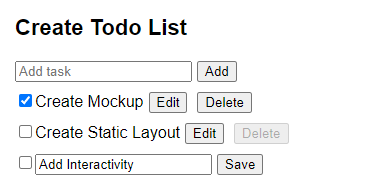

# **Building a Todo List**

## **Objectives**
Upon completion, this lab demonstrates the ability to:

* Use the useReducer and/or useImmerReducer hook to manage state with reducer functions.
* Use useState in places where reducers are not appropriate or necessary.
* Implement controlled forms and inputs.
* Effectively decide where pieces of state should live.
* Use conditional rendering and conditional styling to provide a positive, interactive user experience.
* Create a complete React application from a set of desired functionality.

## **Instructions**
This lab will test your ability to build an application from scratch, using a set of desired functionality to drive your design decisions.

Create a React CodeSandbox and name it "React Todo List."
Follow the requirements below to create your React application.
Submit the link to your CodeSandbox on Canvas when you are finished.
The layout and styling of the application is left up to your discretion. There are no layout or styling requirements, but you should always make sure your applications are neat, sensible, and provide a good user experience. If you are left with extra time, there is always more styling to be done!

## **Requirements** 
After reading through the requirements below, it is recommended you start with a mockup and follow the steps described in "Thinking in React" to complete your application. Remember, stay organized!

 Your todo list application must have:

1. A heading labeling it as a "todo list."
2. A list of "todo" items, which are strings listing activities to be accomplished (e.g. "find that missing sock"). Each "todo" item should have:

    1. A checkbox next to it which indicates whether it is "complete."
    2. A "delete" button next to it which removes it from the list.

        * The "delete" button should be disabled unless the todo is complete!
    3. An "edit" button that replaces the todo string with a text input used to edit the todo.

    * Hint: bind the value of this text input to a piece of state so that it is always accurate, even when first displayed!
    * When this text input is active, the "delete" and "edit" buttons should be hidden, and a "save" button should appear. The "save" button should save any changes made to the todo within the text input.
3. An input element that creates new todo items and adds them to the list.
4. New todos should be added to the top of the list visually; the oldest todos should be at the bottom.

Here is a simple example of what your application might look like upon completion:

As an additional piece of starting information, below is an example of what your todo list data could look like. It does not need to conform to this structure if you would like to format it differently, but this is a good starting point.

This data is taken from the JSONPlaceholder API, which includes a /todos resource. As an additional stretch goal, try fetching your initial state data from this API (if you've finished all of your other requirements and given your application a good bit of style!).

While you could also update the API to match your local state or use the API to work with an external "server state," this goes far beyond the scope of what we've covered so far, and will be discussed in detail during later lessons. There are many powerful tools that aid in these tasks.

const initialState = [
  {
    "userId": 1,
    "id": 1,
    "title": "delectus aut autem",
    "completed": false
  },
  {
    "userId": 1,
    "id": 2,
    "title": "quis ut nam facilis et officia qui",
    "completed": false
  },
  {
    "userId": 1,
    "id": 3,
    "title": "fugiat veniam minus",
    "completed": false
  },
  {
    "userId": 1,
    "id": 4,
    "title": "et porro tempora",
    "completed": true
  },
  {
    "userId": 1,
    "id": 5,
    "title": "laboriosam mollitia et enim quasi adipisci quia provident illum",
    "completed": false
  },
  {
    "userId": 1,
    "id": 6,
    "title": "qui ullam ratione quibusdam voluptatem quia omnis",
    "completed": false
  },
  {
    "userId": 1,
    "id": 7,
    "title": "illo expedita consequatur quia in",
    "completed": false
  },
  {
    "userId": 1,
    "id": 8,
    "title": "quo adipisci enim quam ut ab",
    "completed": true
  },
  {
    "userId": 1,
    "id": 9,
    "title": "molestiae perspiciatis ipsa",
    "completed": false
  },
  {
    "userId": 1,
    "id": 10,
    "title": "illo est ratione doloremque quia maiores aut",
    "completed": true
  },
  {
    "userId": 1,
    "id": 11,
    "title": "vero rerum temporibus dolor",
    "completed": true
  },
  {
    "userId": 1,
    "id": 12,
    "title": "ipsa repellendus fugit nisi",
    "completed": true
  },
  {
    "userId": 1,
    "id": 13,
    "title": "et doloremque nulla",
    "completed": false
  },
  {
    "userId": 1,
    "id": 14,
    "title": "repellendus sunt dolores architecto voluptatum",
    "completed": true
  },
  {
    "userId": 1,
    "id": 15,
    "title": "ab voluptatum amet voluptas",
    "completed": true
  },
  {
    "userId": 1,
    "id": 16,
    "title": "accusamus eos facilis sint et aut voluptatem",
    "completed": true
  },
  {
    "userId": 1,
    "id": 17,
    "title": "quo laboriosam deleniti aut qui",
    "completed": true
  },
  {
    "userId": 1,
    "id": 18,
    "title": "dolorum est consequatur ea mollitia in culpa",
    "completed": false
  },
  {
    "userId": 1,
    "id": 19,
    "title": "molestiae ipsa aut voluptatibus pariatur dolor nihil",
    "completed": true
  },
  {
    "userId": 1,
    "id": 20,
    "title": "ullam nobis libero sapiente ad optio sint",
    "completed": true
  }
];

## Resources
This template provides a minimal setup to get React working in Vite with HMR and some ESLint rules.

Currently, two official plugins are available:

- [@vitejs/plugin-react](https://github.com/vitejs/vite-plugin-react/blob/main/packages/plugin-react/README.md) uses [Babel](https://babeljs.io/) for Fast Refresh
- [@vitejs/plugin-react-swc](https://github.com/vitejs/vite-plugin-react-swc) uses [SWC](https://swc.rs/) for Fast Refresh
# buildingTodoList
